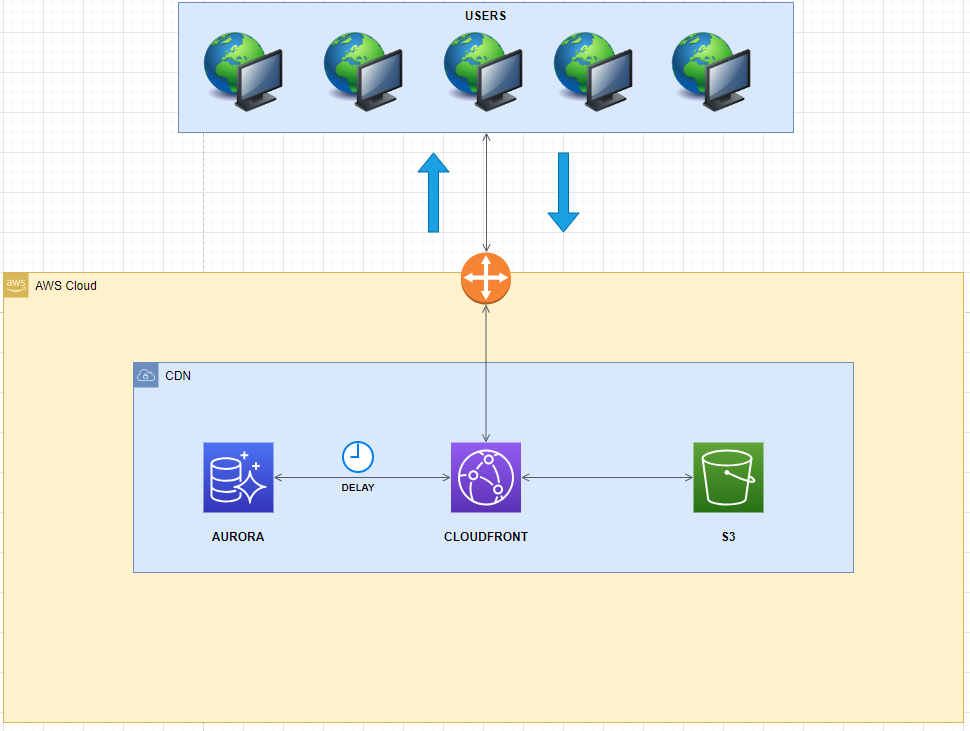

# Projeto Inforbarflix


Cassandra é um banco de dados Nosql da família wide columns, que armazena seus dados de forma esparça, NÃO É UM SUBSTITUTO dos bancos de dados RDBMS, 
e atua justamente onde os RDBMS deixam a desejar quando se trata de alta disponibilidade, escalabilidade e alta performance em ambientes que exijam uma alta taxa de leitura e escrita.

Esse projeto se baseia em uma empresa de streaming de video e vamos resolver com Cassandra um problema comum que diversas empresas de streaming de video possam enfrentar em suas aplicações.

# Arquitetura Atual



# Problema a ser Resolvido

A InforbarFlix é uma empresa de streaming que oferece um amplo catálogo de filmes, séries e documentários para seus usuários em três países (Brasil, Japão e Bélgica). 

Com o aumento da concorrência no mercado de streaming, os clientes estão se tornando cada vez mais exigentes em relação à qualidade da experiência de visualização e à facilidade de uso da plataforma. 
No entanto, um problema que afeta diretamente essa experiência é a lentidão e imprecisão do catálogo de itens (filmes, séries, documentários) já assistidos e marcados para assistir, 
além da perda de itens marcados para assistir ou já assistido. Esse problema pode levar à insatisfação do cliente e à busca por alternativas em outras plataformas.

# Contexto Tecnológico

A empresa possui uma infraestrutura tecnológica sólida e escalável, incluindo vários serviços AWS, como Amazon S3 para armazenar vídeos, CloudFront como CDN para distribuição de conteúdo, 
Amazon EKS para gerenciar os contêineres de back-end (desenvolvidos em Java) e front-end (desenvolvidos em React), ElasticLoad Balancer para distribuição de tráfego e CloudWatch para monitoramento. 
No entanto, o banco de dados Amazon Aurora apresenta problemas, já que as consultas complexas (como ordenação, agrupamento e junção de tabelas) 
devido à natureza relacional do banco de dados tornam a leitura de dados lenta e prejudicam a experiência do usuário.

# Arquitetura Prevista


# Modelo Conceitual 


# Modelo Físico


# Fluxo Aplicacional


# Configurando Cassandra Cluster

⚠️ A arquitetura prevista exige no mínimo um cluster com 9 nós e isto custa muito recurso computacional (mínimo 32gb) para fins de exemplicação o cluster terá 3 nós, mas o passo a passo serve para configurar um cluster de 9 nós multi-dc ⚠️ 

# Recursos Utilizados:
- Conta AWS (ambiente cloud9 Amazon Linux, t3.xlarge 4vcpu 16GIB)
- Docker Versão 25.0.2
- Draw.io
- Hackolade

# 1 - Rodar os Containers do Primeiro Datacenter dc_brasil (Caso tenha os recursos apagar o "#")

```docker run --name jaelson-estudos-n1 -e CASSANDRA_CLUSTER_NAME=Inforbarflix -e CASSANDRA_ENDPOINT_SNITCH=GossipingPropertyFileSnitch -e CASSANDRA_DC=dc_brasil -d cassandra
#docker run --name jaelson-estudos-n2 -e CASSANDRA_SEEDS=172.17.0.2 -e CASSANDRA_CLUSTER_NAME=Inforbarflix -e CASSANDRA_ENDPOINT_SNITCH=GossipingPropertyFileSnitch -e CASSANDRA_DC=dc_brasil -d cassandra
#docker run --name jaelson-estudos-n3 -e CASSANDRA_SEEDS=172.17.0.2 -e CASSANDRA_CLUSTER_NAME=Inforbarflix -e CASSANDRA_ENDPOINT_SNITCH=GossipingPropertyFileSnitch -e CASSANDRA_DC=dc_brasil -d cassandra
```


# 2 - Pegar o IP Para Conectar os Demais Nós

docker inspect <nome_do_container>


# 3 - Conectar Datacenter dc_japao (--memory opcional)

docker run --name jaelson-estudos2-n1 -e CASSANDRA_SEEDS=172.17.0.2 -e CASSANDRA_CLUSTER_NAME=Inforbarflix -e CASSANDRA_ENDPOINT_SNITCH=GossipingPropertyFileSnitch -e CASSANDRA_DC=dc_japao -d cassandra
#docker run --name jaelson-estudos2-n2 -e CASSANDRA_SEEDS=172.17.0.2 -e CASSANDRA_CLUSTER_NAME=Inforbarflix -e CASSANDRA_ENDPOINT_SNITCH=GossipingPropertyFileSnitch -e CASSANDRA_DC=dc_japao -d cassandra
#docker run --name jaelson-estudos2-n3 -e CASSANDRA_SEEDS=172.17.0.2 -e CASSANDRA_CLUSTER_NAME=Inforbarflix -e CASSANDRA_ENDPOINT_SNITCH=GossipingPropertyFileSnitch -e CASSANDRA_DC=dc_japao -d cassandra


# 4 - Conectar Datacenter dc_belgica (--memory opcional)

docker run --name jaelson-estudos3-n1 -e CASSANDRA_SEEDS=172.17.0.2 -e CASSANDRA_CLUSTER_NAME=Inforbarflix -e CASSANDRA_ENDPOINT_SNITCH=GossipingPropertyFileSnitch -e CASSANDRA_DC=dc_belgica -d cassandra
#docker run --name jaelson-estudos3-n2 -e CASSANDRA_SEEDS=172.17.0.2 -e CASSANDRA_CLUSTER_NAME=Inforbarflix -e CASSANDRA_ENDPOINT_SNITCH=GossipingPropertyFileSnitch -e CASSANDRA_DC=dc_belgica -d cassandra
#docker run --name jaelson-estudos3-n3 -e CASSANDRA_SEEDS=172.17.0.2 -e CASSANDRA_CLUSTER_NAME=Inforbarflix -e CASSANDRA_ENDPOINT_SNITCH=GossipingPropertyFileSnitch -e CASSANDRA_DC=dc_belgica -d cassandra


# 5 - Checar Containers em Execução

docker ps


# 6 - Checar Cluster

docker exec -it <nome_do_container> nodetool status


# 7 - Abrir o cqls

docker exec -it <nome_do_container> cqlsh


# 8 - Criar Keyspace

CREATE KEYSPACE inforbarflix
WITH REPLICATION = {
'class' : 'NetworkTopologyStrategy',
'DC_BRASIL' : 3,
'DC_JAPAO' : 3,
'DC_BELGICA' : 3
}
AND DURABLE_WRITES = true;

- NIVEL DE CONSISTÊNCIA

CONSISTENCY LOCAL_ONE;

- USAR KEYSPACE
USE inforbarflix;


# 9 - Checar as Informações da Keyspace

DESCRIBE KEYSPACE inforbarflix;


# 10 - Exemplo Fluxo Aplicacional Q1 (exibir dados do usuário)


